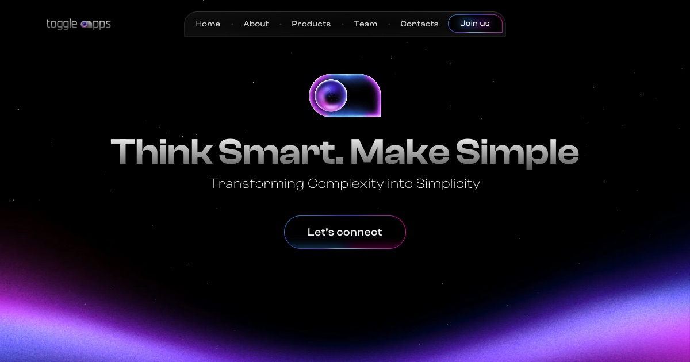

# toggle apps — landing page

Marketing website for [toggle apps](https://toggleapps.io/), built from a Figma design: a scroll-driven landing page with pinned sections, parallax and reveal animations, plus the Privacy Policy, Terms of Service and 404 pages in the same style.



**Lighthouse:** 100 in Accessibility, Best Practices and SEO on every page; Performance 99–100 on the landing page (mobile / desktop) and 100 on the legal pages.

## Tech stack
- [Vite](https://vite.dev/) — dev server and build
- SCSS, autoprefixer via PostCSS
- [GSAP](https://gsap.com/) with ScrollTrigger — pins, scrubbed parallax, section triggers
- [Lenis](https://lenis.darkroom.engineering/) — smooth scroll, driven by the GSAP ticker so scrolling and ScrollTrigger update in the same frame
- Vanilla JS, no framework

## Getting started
Requires Node.js 20.19+ or 22.12+ (Vite 8).

```bash
npm install
npm run dev       # http://localhost:5180
npm run build     # static site in dist/
npm run preview   # serves dist/ at http://localhost:4180
```

## Project structure
```
index.html                  the landing page
privacy-policy/index.html   legal pages: /privacy-policy/ and /terms-of-service/
terms-of-service/index.html
404.html                    not found page
assets/js/
  main.js                   home page entry: Lenis, init order
  subpage.js                legal and 404 pages entry: Lenis with contents links, stars (no GSAP)
  core/                     start (home page setup), env, utils, motion helpers, text splitting
  layout/                   loader, menu, anchors (anchor scroll), stars, footer
  components/               one module per page section
assets/scss/
  style.scss, subpage.scss  entries of the landing page and the subpages
  core/                     variables, motion tokens, mixins, breakpoints, fonts, base styles
  layout/                   loader, header, main, stars, wrapper, footer
  components/               one file per page section, same names as in js/
assets/img, assets/fonts    processed and hashed by Vite
public/                     copied as is: favicons, og-image.jpg, robots.txt
```

## Animation techniques
- **Soft pins.** Sections don't stop dead when they pin: the pin starts a little early and the content eases in and out over quadratic ramps (`softPin`), so scrolling feels continuous.
- **Scroll-scrubbed CSS variables.** GSAP animates custom properties (`--about-parallax`, `--cards-progress`, …) and CSS turns them into transforms, opacity and glows. Registered `@property` values give smooth hover transitions too.
- **Section reveals.** A section gets `.is-revealed` when it reaches the lower quarter of the viewport. The entrance itself is CSS, using shared motion tokens.
- **Anchor navigation.** Menu links scroll at a constant speed with a gentle start and stop. Input is locked during the scroll and the clicked link stays highlighted until arrival.
- **Fixed footer reveal.** On tablets and up the footer sits under the page and is uncovered as the last section scrolls away; phones get a regular footer.

## Legal pages
The Privacy Policy and Terms of Service texts come from the client's site, which serves a generated Termly markup (nested spans, inline styles, unclosed tags). Only the content was taken over: headings, paragraphs, lists and links, rebuilt as semantic BEM markup.

- The logo (linking home) instead of the full header, the landing page's footer, the wave glow and gradient title from its hero, a contents card built from the section headings.
- `subpage.js` is a light entry without GSAP: Lenis smooth scroll with the contents links, the stars, email decoding.
- External links open in a new tab; links between the pages and to sections stay in it.

## 404 page
`404.html` in the same style: the logo, a gradient code over the dimmed black hole from Team, and the Let's connect button (shared `glow-button` mixin) leading home. Static hosts serve it for any missing address, so every path in it is absolute.

## Conventions
- **BEM.** Every styled element has its own class (`block__element`); no tag selectors inside blocks. One file per block, with the same name in `js/` and `scss/`.
- **States** are `is-*` / `has-*` classes (`is-revealed`, `is-open`, `has-fixed-footer`), set from JS; values scrubbed by scroll are CSS variables.
- Each JS and SCSS file starts with a one- or two-line description of what it holds.

## Performance
- **Loader.** The page stays hidden until the fonts and first-screen images are loaded and decoded, then fades in. Artwork below the fold (`html.is-bg-deferred`) is requested only after that.
- **Inline CSS.** The build puts each page's stylesheet (~14 KB gzipped) into a `<style>` in its HTML (`inlineCssPlugin` in `vite.config.js`), so there's no render-blocking request. JS stays external: it doesn't block rendering and is cached.
- **Images.** Large backgrounds are AVIF with a WebP/PNG fallback (`bg-image` mixin). Screenshots and cards are WebP with 2x/3x `srcset`. Logos and team avatars are WebP, and each screen downloads only its own header logo.
- **Fonts.** Inter is subset to the characters in use (5 KB) and only needed on the landing page, which preloads both fonts; the legal pages preload Clash Display only.

## Accessibility
- Semantic landmarks, a logical heading order, alt texts, and real `<button>`s for the menu and Copy.
- Keyboard focus shows the same effects as hover. Tabbing into the fixed footer scrolls it into view.
- **Reduced motion.** With `prefers-reduced-motion`, reveals become plain fades, looping animations and parallax are off, pins lose their soft ramps, anchor jumps are instant and the wheel scrolls natively.
- Works without JS: the loader is skipped and the page is shown as is.

## Email protection
No address is in the markup. `data-email` holds it base64-encoded and JS decodes it (`initContacts` on the landing page, `subpage.js` on the legal pages, where it becomes a `mailto:` link), similar to Cloudflare Email Obfuscation on the production site. Without JS the pages show `hello [at] toggleapps.io`.

## Browser support
The last 2 versions of evergreen browsers (`browserslist` in `package.json`). The minimum supported width is 320px.

## Deploy
The demo is hosted on **Cloudflare Pages**, built from this repository on every push to `main`. Any static hosting works: deploy the `dist/` folder.

Cloudflare Pages settings:
- Build command `npm run build`, output directory `dist`, root directory empty.
- Environment variables: `NODE_VERSION` = `22`, `SITE_URL` = the demo address, e.g. `https://toggle.example.com` (used for the absolute Open Graph URLs; without it those tags and the `og:image` details are omitted).
- Custom domain: add the subdomain in the project's Custom domains; with DNS elsewhere, point a `CNAME` for it to `<project>.pages.dev`.

What the host takes care of:
- `404.html` is served for any missing address.
- `/privacy-policy` redirects to `/privacy-policy/` (the pages are folders with an `index.html`).
- `public/_headers` caches `/assets/*` for a year (`immutable`: the file names contain content hashes) and adds basic security headers.

## License
This is a portfolio copy of the client's live site. The design, texts, images and the toggle apps brand belong to toggle apps sp. z o.o.; the repository is published for reference only and isn't licensed for reuse.
